### An introduction to containers using Docker
null puliya by ***Madhu Akula***
3rd June 2017


### About Me !
- Automation Ninja at [Appsecco](http://appsecco.com)
- Fusion of Security, DevOps and Cloud
- Speaker & Trainer at Defcon, All Day DevOps, DevSecCon, etc
- Found bugs in Google, Microsoft, Yahoo, etc
- Never ending learner
- Follow (or) Tweet to me [@madhuakula](https://twitter.com/madhuakula)


### What you are going to learn?
- What is docker?
- How to use docker commands
- Working with Docker and docker-compose tools
- Creating and running your own container
- Best practices & Tips
- Security Automation use cases


### Pre-requisites
- Basics of Linux commands usage
- Laptop with administrative privileges and support for running 64-bit virtual machines
- VirtualBox 5.x
- Minimum 4GB RAM and 15 GB disk space for VM and data
- Internet connection (If you wanted to everything hands-on)


### Import virtual machine appliance
- Please import the virtual machine appliance from `null-puliya-docker/docker-training.ova`


### Start the virtual machine & Login

```
Username: nel
Password: nulldocker
```


### SSH into VM from host

```
Windows: Putty
Linux/MAC: SSH client
```

```
$ ssh nel@192.168.56.101
```


### History Lesson

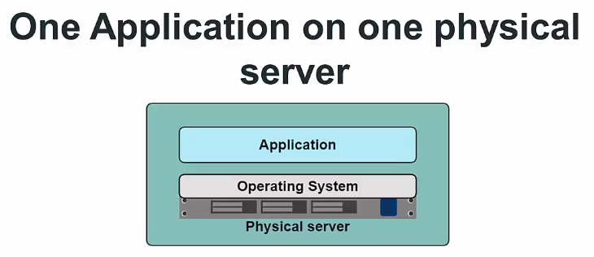


### Problems with physical servers

- Slow deployment times
- Huge costs
- Wasted resources
- Difficult to scale
- Difficult to migrate
- Vendor lock in


### Hypervisor-based virtualization

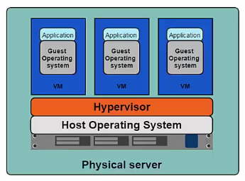

- One physical server can contain multiple applications
- Each application runs in a virtual machine(VM)


### Benefits of VMs

- Better resource pooling
    + One physical machine divided into multiple virtual machines
- Easier to scale
- VM's in the cloud
    + Rapid elasticity
    + Pay as you go mode
- Kernel Security


### Limitations of VM's

- Each VM still requires
    + CPU allocation
    + Storage
    + RAM
    + An entire guest operating system
- The more VM's you run, the more resources you need
- Guest OS means wasted resources
- Applications portability not guaranteed


### Introducing Containers

> Container based virtualization use the kernel on the host's operating system to run multiple guest instances

- Each guest instance is called a `container`
- Each container has its own
    + Root File System
    + Processes
    + Memory
    + Devices
    + Network ports


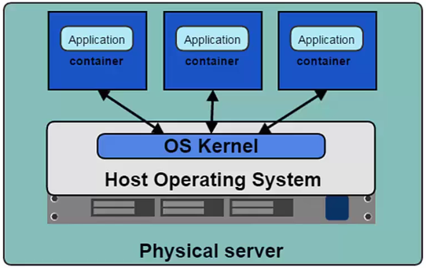


### Containers advantages over Virtual Machines

- Containers are more lightweight
- No need to install guest OS
- Less CPU, RAM, Storage space required
- More containers per machine than VMs
- Greater portability


### Introducing Docker

Docker containers wrap a piece of software in a complete filesystem that contains everything needed to run: code, runtime, system tools, system libraries – anything that can be installed on a server. This guarantees that the software will always run the same, regardless of its environment.


### How Docker Works?

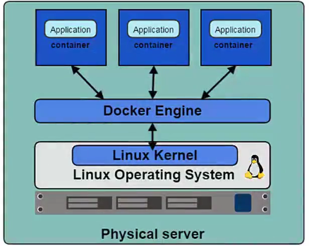

- `Docker` is the program that enables containers to be built, shipped and run.
- Docker Engine uses Linux Kernel namespaces and control groups, Namespaces gives us the isolated workspace (pid, net, ipc, mount, other)


### Multiple products/tools

component | description
--- | ---
Docker Engine | Core functions to Docker images to create and start Docker container.
Docker Machine | Automated Container Provisioning.
Docker Swarm | Allows container clustering and scheduling.
Docker Compose | Allows to define multi-container environments and operate.
Docker Hub | From Docker Docker operated registry.
Docker Trusted Registry | Allows to operate private Docker registries.
Docker Cloud | From Docker Docker driven environment. (Build, CI, Deploy)
Docker Universal Control Plane | Cluster Management for Docker environments.
Kitematic | Simple application for managing Docker containers


### Basics & Terminology

- Docker Image
    + Read only with os, libraries and apps
- Docker Container
    + Stateful instance of image with a writable layer
-  Docker Registry
    + Repository of images
- Docker Hub
    + Public docker registry


### Enough! Let's start Docker

- Docker is already installed in your VM
- If you want to install [https://docs.docker.com/engine/installation/#supported-platforms](https://docs.docker.com/engine/installation/#supported-platforms)


### Everyone is inside VM?

- Let's test by running `sudo docker --version` command


### Why sudo before docker command?

- To run docker commands we need `sudo` privileges.
- Add current user to docker group

```
$ sudo usermod -aG docker nel
```


### SSH again to apply changes

- Now run again the `docker --version` command without sudo
- Hence, if someone has access to docker group they can have super user privileges (root) : Security**
- We will use this for LAB purpose only


### Docker Workflow

- Client / Server architecture
- Client takes user inputs and send them to the daemon
- Daemon build, runs and distributes containers
- Client and daemon can run on the same host or on different hosts
- CLI client and GUI (Kitematic)


### Run your first docker container

```
$ docker run hello-world
```

- `docker run` command send this command to engine
- Engine checks if the image available or not
    + If it's not available, it will pull from registry
    + If it's available, it will run the command from local image


### Docker containers & Images

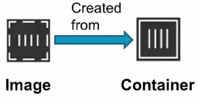

- Images
    + Read only template used to create containers
    + Built by you to other Docker users
    + Stored in Docker hub or your local registry
    
- containers 
    + Isolated application platform
    + Contains everything needed to run your application
    + Based on one or more images


### Registry & Repository

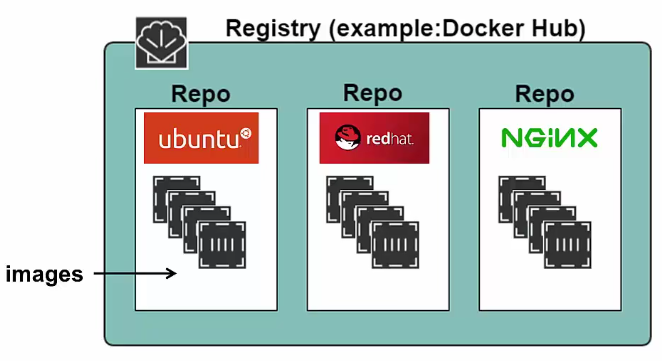


### What is Docker Hub?

- Docker Hub is the public registry that contains a large number of images available for your use

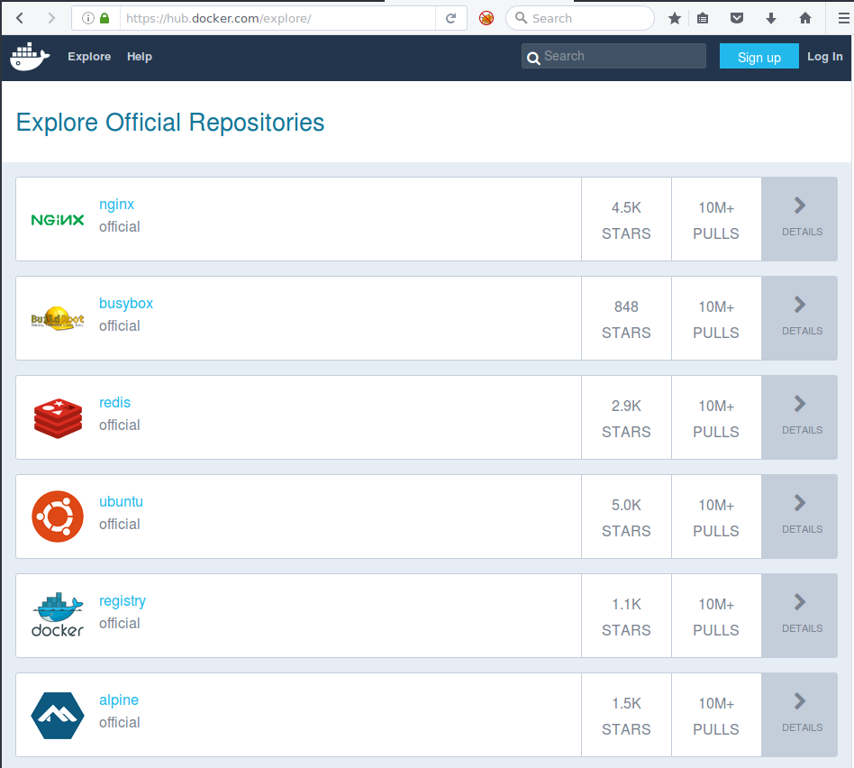


### Docker Search

- You can also search through all public available images in docker hub via 

```
$ docker search wpscan
```


### Docker Store

- [https://store.docker.com](https://store.docker.com/) is a  Trusted and Enterprise Ready Containers, Plugins, and Docker Editions


### How to find local available images

```
$ docker images
```

- Images are specified by `repository:tag`
- The same image may have multiple tags
- The default tag is `latest`
- Look up the repository on Docker Hub to see what tags are available


### Running docker container

```
$ docker run [options] [image] [command] [args]
```

- Image is specified with `repository:tag`

Example:

```
$ docker run ubuntu:14.04 echo "Welcome to Ubuntu 14.04"
```


### What's inside container?

```
$ docker run ubuntu:14.04 ps ax
```


### Container with Terminal

- Use `-i` and `-t` flags with docker run
- The `-i` flag tells docker to connect to STDIN on the container
- The `-t` flag specifies to get pseudo-terminal
- *Note:* You need to run a terminal process as your command (e.g. /bin/bash)

```
$ docker run -i -t ubuntu:14.04 /bin/bash
```


### Container Processes

- A container only runs as long as the process from your specified `docker run` command is running
- Your command's process is always `PID 1` inside the container

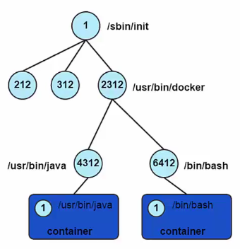


### Container Processes Example

```
$ docker run -it ubuntu bash
root@randomvalue:/# ps -ef
```

- Exit the container with out closing `Ctrl + P + Q`

```
$ ps -ef
```


### Container ID

- Containers can be specified using their ID or name
- Long ID and short ID
- Short ID and name can be obtained using `docker ps` command to list containers
- Login ID obtained by inspecting a container `docker inspect`


### Naming containers

- You can create specific name for container before running

```
$ docker run --name sampleapp ubuntu:14.04 uname
```


### Find your containers

- Use `docker ps` to list running containers
- The `-a` flag to list all containers (includes containers that are stopped)

```
$ docker ps
$ docker ps -a
```


### Running in Detached Mode

- Also known as running in the background or as a daemon 
- Use `-d` flag
- To observe output use `docker logs [container id]`

```
$ docker run -d ubuntu:14.04 ping 127.0.0.1 -c 50

$ docker logs [container id]

$ docker logs -f [container id]
```


### Running Docker attach

```
$ docker run -d --name topdemo ubuntu:14.04 /usr/bin/top -b
$ docker attach topdemo
```


### Running a practical container

- Run a web application inside a container
- The `-P` flag to map container ports(all exposed) to host ports

```
$ docker run -d -P nginx:alpine

$ docker ps
```

- Now we can browse to the mapped port in our localhost
- Make a `curl` request to check 

```
$ curl localhost:mapped port
```


### Running a practical container (contd.)

- To specify certain port for mapping

```
$ docker run -d -p 3000:80 nginx:alpine
```

```
$ curl localhost:3000
```

- You can also navigate to your browser with host IP address and port


### Image Layers

- Images are comprised of multiple layers
- A layer is also just another image
- Every image contains a base layer
- Docker uses a copy on write system
- Layers are read only

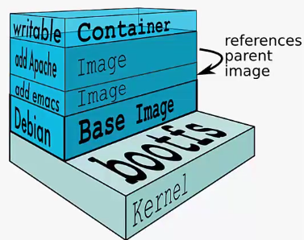


## The container writeable layer

- Docker creates a top writeable layer for containers
- Parent images are read only
- All changes are made at the writeable layer

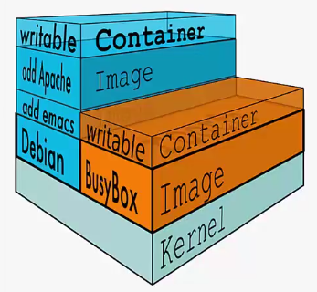


### Docker Commit

- `docker commit` command saves changes in a container as a new image 
- Syntax

```
docker commit [options] [container ID] [repository:tag]
```

- Repository name should be based on username/application
- Can reference the container with container name instead of ID


### Docker Commit (contd.)

```
$ docker run --name testingcommit -it ubuntu:14.04 bash

# mkdir -p /data/important

# echo "this is important data" > /data/important/credentials.txt

# exit

$ docker ps -a

$ docker commit testingcommit madhuakula/testapp:1.0

$ docker images
```


### Using the new image

```
$ docker run -it madhuakula/testapp:1.0 bash

# cat /data/important/credentials.txt
```


### Introducing Dockerfile

> A `Dockerfile` is a configuration file that contains instructions for building a Docker image

- Provides a more effective way to build images compared to using `docker commit`
- Easily fits into your continuous integration and deployment process


### Dockerfile instructions

- Instructions specify what to do when building the image
- `FROM` instruction specifies what the base image should be
- `RUN` instruction specifies a command to execute

```
# Example of a comment
FROM ubuntu:14.04

RUN apt-get update
RUN apt-get install curl -y
RUN apt-get install htop -y
```


### More about `RUN` instruction

- Each `RUN` instruction will execute the command on the top writeable layer and perform a commit of the image
- Can aggregate multiple `RUN` instructions by using `&&`

```
RUN apt-get update && apt-get install -y \
    curl \
    htop
```


### Docker Build

```
docker build [options] [path]
```

- Common option to tag the build

```
docker build -t [repository:tag] [path]
```

Example:

```
# Build an image using current folder as context path
$ docker build -t madhuakula/testimage:1.0 .

# Build an image using `myproject` folder as context path
$ docker build -t madhuakula/testimage:1.0 myproject
```

- By default it looks for the `Dockerfile`
- You can specify the different file using `-f` flag


### Exercise

```
$ mkdir first_image_build
$ cd first_image_build
```

- Create a Dockerfile using `vi Dockerfile`

```
FROM ubuntu:14.04
RUN apt-get update
RUN apt-get install -y curl
RUN apt-get install -y nmap
```

- Then run the docker build command

```
$ docker build -t madhuakula/testimage:1.0 .
```


### Exercise (contd.)

- Verify by running the `docker images` command

```
$ docker images
```

- Modify the Dockerfile using `vi Dockerfile`

```
FROM ubuntu:14.04
RUN apt-get update && apt-get install -y \
    curl \
    vim
```

- Run the docker build command again

```
$ docker build -t madhuakula/testimage:1.1 .
```


### CMD Instruction

- CMD defines a default command to execute when a container is created
- CMD performs no action during the image build
- Shell format and EXEC format (JSON array)
- Can only be specified once in a Dockerfile
- Can be overridden at run time

```
Shell format
CMD ping 127.0.0.1 -c 30

Exec format
CMD ["ping", "127.0.0.1", "-c", "30"]
```


### Example

- Modify the Dockerfile using `vim Dockerfile`

```
FROM ubuntu:14.04
RUN apt-get update && apt-get install -y \
    curl 

CMD ["ping", "127.0.0.1", "-c", "10"]
```

- Run the docker build command again

```
$ docker build -t madhuakula/testimage:1.2 .
```

- Check the CMD by running docker image

```
$ docker run madhuakula/testimage:1.2
```

- Override the CMD instruction

```
$ docker run madhuakula/testimage:1.2 echo "hello world"
```


### ENTRYPOINT Instruction

- Defines the command that will run when a container is executed
- Run time arguments and CMD instruction are passed as parameters to the ENTRYPOINT instruction
- Shell and EXEC form
- EXEC form preferred as shell form cannot accept arguments at run time 
- Container essentially runs as an executable

```
ENTRYPOINT ["ping"]
```


### Example

- Modify the Dockerfile using `vim Dockerfile`

```
FROM ubuntu:14.04
RUN apt-get update && apt-get install -y \
    curl 

ENTRYPOINT ["ping"]
```

- Run the docker build command again

```
$ docker build -t madhuakula/testimage:1.3 .
```

- Check the ENTRYPOINT by running docker image

```
$ docker run madhuakula/testimage:1.3

$ docker run madhuakula/testimage:1.3 127.0.0.1 -c 5
```


### Managing Images and Containers

**Start and Stop Containers**

- Find your containers with `docker ps` and note the ID or name
- `docker start` and `docker stop`

```
List all containers
$ docker ps -a

Start a container using the container ID
$ docker start <container ID>

Stop a container using the container ID
$ docker stop <container ID>
```


### Example

```
$ docker run --name samplenginxapp  -d nginx:alpine

$ docker ps

$ docker stop samplenginxapp

$ docker ps

$ docker ps -a

$ docker start samplenginxapp
```


### Getting terminal access

- Use `docker exec` command to start another process within a container
- Execute `/bin/bash` to get a bash shell (or) `/bin/sh`

```
docker exec -i -t [container ID] /bin/bash
```

- First run a container

```
$ docker run --name nginxapp -d nginx:alpine
```

- Exiting from the terminal will not terminate the container

```
$ docker exec -it nginxapp /bin/sh
```


### Deleting Containers

- Can only delete containers that have been stopped
- Use `docker rm` command
- Specify the container ID or name


### Example

```
$ docker run --name anotherapp -d nginx:alpine

$ docker ps

$ docker stop anotherapp

$ docker ps -a

$ docker rm anotherapp

$ docker ps -a
```


###  Deleting local images

```
docker rmi [image ID]
(or)
docker rmi [repo:tag]
```

- If an image is tagged multiple items, we have to remove each tag


### Example

```
$ docker images

$ docker rmi madhuakula/testimage:1.1

$ docker images

$ docker rmi f26a6ce913b7

$ docker images
```


### Docker Hub Repositories

- Users can create their own repositories on Docker Hub
- Public and Private
- Push local images to a repository


### Pushing images to Docker Hub

```
docker push [repo:tag]
```

- Local repo must have same name and tag as the Docker Hub repo

```
$ docker push madhuakula/testingimage:1.0
```


### Tagging Images

- Used to rename a local image repository before pushing to Docker Hub

```
docker tag [image ID] [repo:tag]

OR

docker tag [local repo:tag] [Docker Hub repo:tag]
```

**Examples:**

```
$ docker tag f26a6ce913b7 madhuakula/testexample:1.0

OR

$ docker tag madhuakula/testimage:1.1 madhuakula/testanotherexample
```


### Volumes

> A volume is a designated directory in a container, which is designed to persist data, independent of the container's life cycle

- Volume changes are excluded when updating an image
- Persist when a container is deleted
- Can be mapped to a host folder
- Can be shared between containers


### Mount a Volume

- Volumes are mounted when creating or executing a container
- Can be mapped to a host directory
- Volume paths specified must be absolute

```
Execute a new container and mount the folder /myvolume into it's file system

$ docker run -d -P -v /myvolume nginx:alpine

Execute a new container and map the /data/src folder from the host into the /test/src folder in the container

$ docker run -i -t -v /data/src:/test/src nginx:alpine sh
```


### Volumes in Dockefile

- VOLUME instruction creates a mount point
- Can specify arguments JSON array or string
- Cannot map volumes to host directories
- Volumes are initialized when the container is executed

```
# string example
VOLUME /myvol

# string example with multiple volumes
VOLUME /www/website1.com /www/website2.com

# JSON example
VOLUME ["myvol", "myvol2"]
```


### Use of volumes

- De-couple the data that is stored from the container which created the data
- Good for sharing data between containers
    + Can setup a data containers which has a volume you mount in other containers
- Mounting folders from the host is good for testing purposes but generally not recommended for production use


### Docker Networking

**Mapping Ports**

- Recall: containers have their own network and IP address
- Map exposed container ports to ports on the host machine
- Ports can be manually mapped or auto mapped
- Uses the `-p` and `-P` parameters in `docker run`

```
Map port 80 on the container to 8080 on the host
$ docker run -d -p 8080:80 nginx:alpine
```


### Auto mapping ports

- Use the `-P` option in `docker run`
- Automatically maps exposed ports in the container to a port number in the host
- Host port numbers used to go from `49153` to `65535`
- Only works for ports defined in the `EXPOSE` instruction

```
Auto map ports exposed by the NGINX container to a port value on the host
$ docker run -d -P nginx:alpine
```


### Linking Containers

> Linking is a communication method between containers which allows them to securely transfer data from one to another

- Source and recipient containers
- Recipient containers have access to data on source containers
- Links are established based on container names

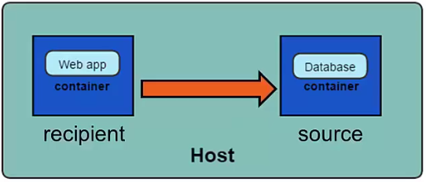


### Creating a Link

- Create the source container first
- Create the recipient container to use `--link` option

- *Best practice* - give your containers meaningful names

```
Create the source container using the postgres
$ docker run -d --name database mysql:5.7

Create the recipient container and link it
$ docker run -d -P --name website --link database:db nginx:alpine
```

- check `/etc/hosts` of `website` container for more reference

```
$ docker run -it website sh

# cat /etc/hosts
```


### Uses of Linking

- Containers can talk to each other without having to expose ports to the host
- Essential for micro service applications architecture
- Example:
    + Container with Tomcat running
    + Container with MySQL running
    + Application on Tomcat needs to connect to MySQL


### Docker logs

```
$ docker logs -f --tail 2 <Container NAME>
```


### Inspecting a Container

```
$ docker inspect <container name>

OR

$ docker inspect <container name> | grep IPAddress

OR

$ docker inspect <container name> | jq .
```


### Docker history

```
docker history [OPTIONS] IMAGE
```

```
$ docker history nginx:alpine
```


### Docker Diff

List the changed files and directories in a containers filesystem There are 3 events that are listed in the diff:

- A - Add
- D - Delete
- C - Change

For example:

```
$ docker run --name checkingimage  -it ubuntu:14.04 bash

# mkdir -p /data/output
# echo "modifed this stuff" > /.dockerenv
# exit

$ docker diff checkingimage
```


### Docker stats

- You can get stats from containers using

```
$ docker run --name statstest -d nginx:alpine

$ docker run -d nginx:alpine

$ docker ps

$ docker stats statstest

$ docker stats --all
```


### Docker top

```
docker top CONTAINER [ps OPTIONS]
```

Example:
```
$ docker run --name toptestcontainer -d nginx:alpine

$ docker top toptestcontainer
```


### 


### Traditional Continuous Integration

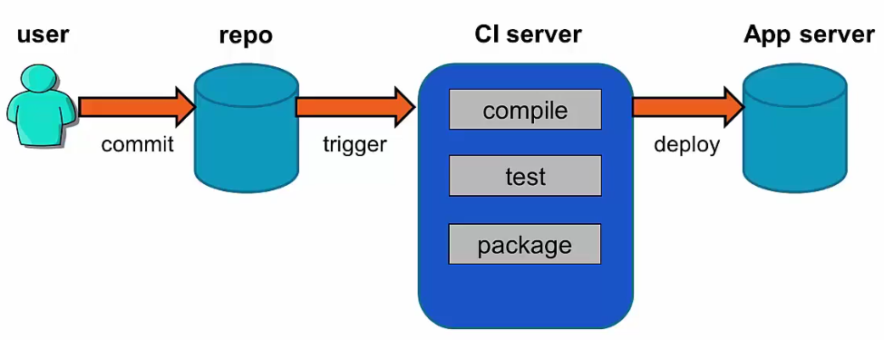


### Using Docker in CI

- CI server builds Docker image and pushes into Docker Hub

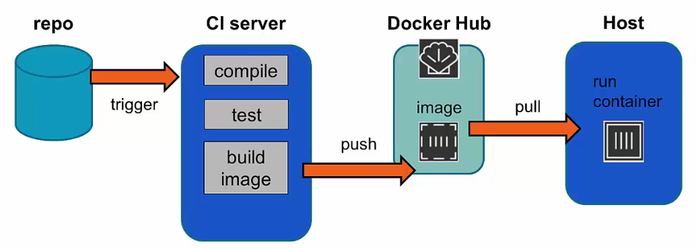


### Docker Hub Auto Build

- Docker Hub detects commits to source repository and builds the image 
- Container is run during image build
- Testing done inside container


### Example

- Login to your Github account
- Create a new repository `null-docker-puliya-test`
- Add a `Dockerfile` in that repository

```
FROM ubuntu:16.04
MAINTAINER Madhu Akula <madhu.akula@hotmail.com>

RUN apt-get update && apt-get install curl \
            htop -y
```

- Login to your Dockerhub account and create automated build
- Link your github and select the github repository `null-docker-puliya-test`
- Then give the details and trigger build.


### Example (contd.)

- Update the Dockerfile in Github

```
FROM ubuntu:16.04
MAINTAINER Madhu Akula <madhu.akula@hotmail.com>

RUN apt-get update && apt-get install curl \
            nmap htop

ENTRYPOINT ["ping"]
```

- Now check your Dockerhub, it will automatically trigger the new build


### Docker Private Registry 

- Docker Registry can be available  as a Docker container `registry:2`
- Create a directory in host system `mkdir -p /tmp/localregistrydata`, which we will mount inside the registry container as volume.
- This volume will contain all the registry data.

```
$ docker run -d -p 5000:5000 -v /tmp/localregistrydata-data:/var/lib/registry
registry:latest
```


### Pushing Images to Private Registry (Demo)

- Tag an image before pushing

```
$ docker tag <image_id> localhost:5000/newimage
```

-  Push to the registry

```
$ docker push localhost:5000/newimage
```

- Pulling the image from private registry

```
$ docker pull localhost:5000/newimage
```


### Docker Networking Drivers

- All apps are differently designed. Some of them required additional access like wordpress with mysql
- So Docker networking will play key role in working with multiple containers


### Docker Networking (Link Example)

- We have already seen `--link` command flag

```
$ docker run -d --name netcontainer1 alpine sleep 1000
$ docker run --name netcontainer2 --link netcontainer1 -i -t alpine /bin/sh
```

-  The netcontainer2 will be able to ping netcontainer1 using its name, which is `netcontainer1`


### Docker Networking Drivers (contd.)

- By default, Docker installation create three networks
    + None (gets no network connection, good for security stuff)
    + Host (inside the container would be identical to the hosts, like network interface names and ip addresses.)
    + Bridge (by default,  allows containers in the same bridge network to
access to each other. It spans within the host system)
- Overlay network is the most commonly used in networking. (access 
between containers running in different hosts. It requires a key-value store like etcd, consul (or) zookeeper) 


### Docker Bridge Network Example (ISOLATION)

- Creating bridge network

```
$ docker network create --driver bridge different_network
```

- Running container in this bridge network

```
$ docker run --name bridgecontianer --network=different_network -d -i -t alpine /bin/sh
```

- Run another container with default bridge network and ping `bridgecontianer`

```
$ docker run -it alpine /bin/sh

# ping bridgecontianer
```


### Docker Logging

- Docker supports different logging methods for storing and shipping
logs.
- Default the messages are written as a json
- Here are some of them in many drivers docker support, json-file, syslog, journald, gelf, fluentd, splunk.


### Writing Awesome Dockerfiles

* [.dockerignore](https://docs.docker.com/engine/reference/builder/#dockerignore-file)
* [FROM](https://docs.docker.com/engine/reference/builder/#from) Sets the Base Image for subsequent instructions.
* [MAINTAINER (deprecated - use LABEL instead)](https://docs.docker.com/engine/reference/builder/#/maintainer-deprecated) Set the Author field of the generated images.
* [RUN](https://docs.docker.com/engine/reference/builder/#run) execute any commands in a new layer on top of the current image and commit the results.
* [CMD](https://docs.docker.com/engine/reference/builder/#cmd) provide defaults for an executing container.


### Writing Awesome Dockerfiles (contd.)

* [EXPOSE](https://docs.docker.com/engine/reference/builder/#expose) informs Docker that the container listens on the specified network ports at runtime.  NOTE: does not actually make ports accessible.
* [ENV](https://docs.docker.com/engine/reference/builder/#env) sets environment variable.
* [ADD](https://docs.docker.com/engine/reference/builder/#add) copies new files, directories or remote file to container.  Invalidates caches. Avoid `ADD` and use `COPY` instead.
* [COPY](https://docs.docker.com/engine/reference/builder/#copy) copies new files or directories to container.  Note that this only copies as root, so you have to chown manually regardless of your USER / WORKDIR setting.  See https://github.com/moby/moby/issues/30110


### Writing Awesome Dockerfiles (contd.)

* [ENTRYPOINT](https://docs.docker.com/engine/reference/builder/#entrypoint) configures a container that will run as an executable.
* [VOLUME](https://docs.docker.com/engine/reference/builder/#volume) creates a mount point for externally mounted volumes or other containers.
* [USER](https://docs.docker.com/engine/reference/builder/#user) sets the user name for following RUN / CMD / ENTRYPOINT commands.
* [WORKDIR](https://docs.docker.com/engine/reference/builder/#workdir) sets the working directory.
* [ARG](https://docs.docker.com/engine/reference/builder/#arg) defines a build-time variable.


### Writing Awesome Dockerfiles (contd.)

* [ONBUILD](https://docs.docker.com/engine/reference/builder/#onbuild) adds a trigger instruction when the image is used as the base for another build.
* [STOPSIGNAL](https://docs.docker.com/engine/reference/builder/#stopsignal) sets the system call signal that will be sent to the container to exit.
* [LABEL](https://docs.docker.com/engine/userguide/labels-custom-metadata/) apply key/value metadata to your images, containers, or daemons.


### Docker Compose

- Docker Compose is a tool to define and run multi container applications
- It contains Dockerfiles, images, environment variables, volumes, ports, etc.
- It's written in YAML format


### Features

- Multiple isolated environments on a single host
- Preserve volume data when containers are created
- Only recreate containers that have changed
- Variables and moving a composition between environments


### Docker Compose usage

- Define your app’s environment with a `Dockerfile` so it can be reproduced anywhere.
- Define the services that make up your app in `docker-compose.yml` so they can be run together in an isolated environment.
- Lastly, run `docker-compose up` and Compose will start and run your entire app.


### Docker Compose Example Overview

```
version: '3'
services:
  web:
    build: .
    ports:
    - "5000:5000"
    volumes:
    - .:/code
    - logvolume01:/var/log
    links:
    - redis
  redis:
    image: redis
volumes:
  logvolume01: {}
```


### Docker Compose Wordpress Example

- Create a new directory `mkdir composewordpress` and `cd composewordpress`
- Create `vi docker-compose.yml` file

```
version: '3'

services:
   db:
     image: mysql:5.7
     volumes:
       - db_data:/var/lib/mysql
     restart: always
     environment:
       MYSQL_ROOT_PASSWORD: somewordpress
       MYSQL_DATABASE: wordpress
       MYSQL_USER: wordpress
       MYSQL_PASSWORD: wordpress

   wordpress:
     depends_on:
       - db
     image: wordpress:latest
     ports:
       - "8000:80"
     restart: always
     environment:
       WORDPRESS_DB_HOST: db:3306
       WORDPRESS_DB_USER: wordpress
       WORDPRESS_DB_PASSWORD: wordpress
volumes:
    db_data:
```


### Running docker-compose

- Run `docker-compose up -d db`
- Wait for a ***minute*** to start the database and configuration
- Then run `docker-compose up -d wordpress`
- Now browse to `http://hostIP:8000` in your browser


### Check compose status

```
$ docker-compose ps

$ docker ps
```


### How about scaling stuff?

```
$ docker-compose scale wordpress=3

$ docker-compose ps
```


### Security Automation use cases

- Let's run our `wpscan` against running wordpress site

```
$ docker run -it --rm wpscanteam/wpscan -u http://YOURHOSTIP:8000
```


### Security Automation use cases (contd.)

- How long does it take you to setup vulnerable application?

```
$ docker run --name dsvw -p 5000:8000 -d appsecco/dsvw
```

- Navigate to `http://YOURHOSTIP:5000` in your browser


### Security Automation use cases (contd.)

- There are many more use cases and containers already available
    + Exploits (https://hub.docker.com/r/vulnerables)
    + Vulnerable Apps (https://hub.docker.com/u/owasp/)
    + Kali Linux (https://hub.docker.com/r/kalilinux/kali-linux-docker/)
    + OWASP ZAP (https://hub.docker.com/r/owasp/zap2docker-stable/)
    + Many more


### Security Automation use cases (contd.)

- Adding security into DevOps pipeline using containers
- Setting up & Building vulnerable labs
- Isolated test environment (kind of sandbox)
- Many more.


### Security Automation use cases (contd.)

***What do you think of Docker, Any use cases?***


### Docker Swarm

> The cluster management and orchestration features embedded in the Docker Engine are built using SwarmKit. 

A swarm is a cluster of Docker engines, or nodes, where you deploy services. The Docker Engine CLI and API include commands to manage swarm nodes (e.g., add or remove nodes), and deploy and orchestrate services across the swarm.


### Docker Swarm Features

- Cluster management integrated with Docker Engine
- Decentralized design
- Declarative service model
- Scaling
- Desired state reconciliation
- Multi-host networking
- Service discovery
- Load balancing
- Secure by default
- Rolling updates


### Popular Alternatives for Docker Swarm

- Kubernetes aka k8s
- Apache Mesos and Marathon
- Nomad
- DC/OS
- Many more.


### The easiest way to manage docker (Portainer)

> Portainer is an open-source lightweight management UI which allows you to easily manage your Docker host or Swarm cluster.


### Running Portainer

- It's as simple as running the below command

```
$ docker run --name portainer -d -p 9000:9000 -v "/var/run/docker.sock:/var/run/docker.sock" portainer/portainer
```


### Auto completion of docker commands

https://github.com/j-bennet/wharfee


### Resources & References

- https://training.docker.com/introduction-to-docker
- https://training.docker.com/docker-fundamentals
- https://docs.docker.com/engine/getstarted/
- https://github.com/wsargent/docker-cheat-sheet
- https://docs.docker.com/engine/userguide/eng-image/dockerfile_best-practices/
- http://training.play-with-docker.com
- https://www.katacoda.com/courses/docker


### Thanks & Feedback

**Madhu Akula**
[@madhuakula](https://twitter.com/madhuakula)